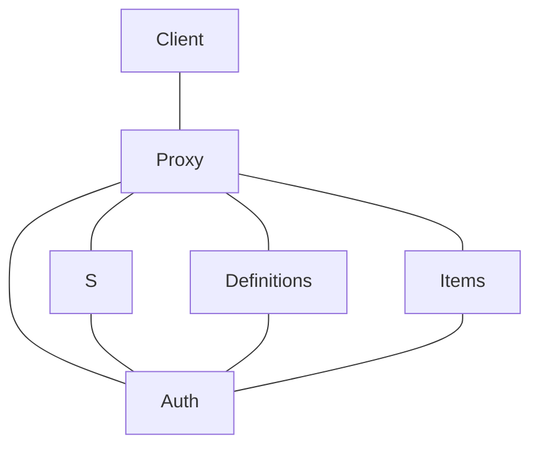
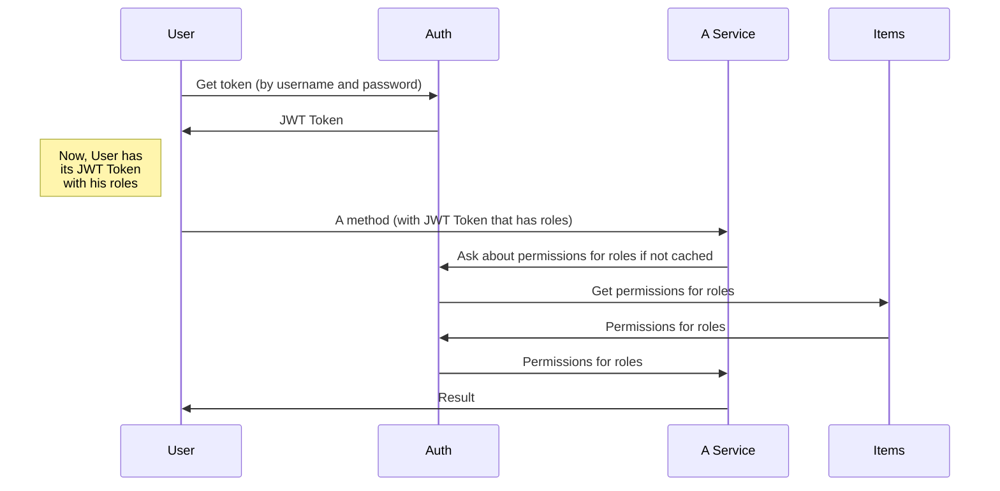

# Instap documentation

The real [Documentation](https://odwrotnie.github.io/instap-documentation/)

## Authentication

The **S** can be one of each:
- Setup
- CRON LDAP
- Calculations

**JWT Token** consists of:
- roles: List[String]

