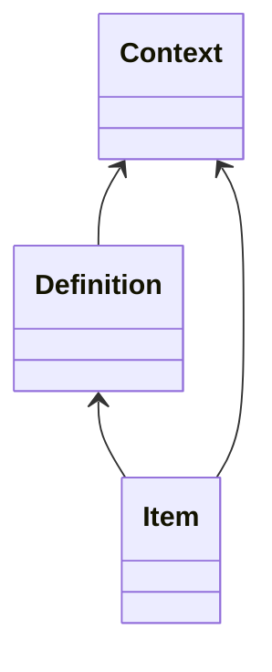

# Instap documentation

User [Documentation](https://odwrotnie.github.io/instap-documentation/)

## Contexts

Each **user** is assigned to a **context**. In specific cases user can switch to another **context**.

- Definition's context == null (global definition)
  - Item's context != null (accessible only in selected context)
  - Item's context == null (accessible in all contexts)
- Definition's context == X
  - Item's context == null (accessible only in context X)
  - Item's context == X (accessible only in context X)
  - Item's context == Y (accessible only in context X)
  
## Authentication

The **S** can be one of each:
- Setup
- CRON LDAP
- Calculations

**JWT Token** consists of:
- roles: List[String]

