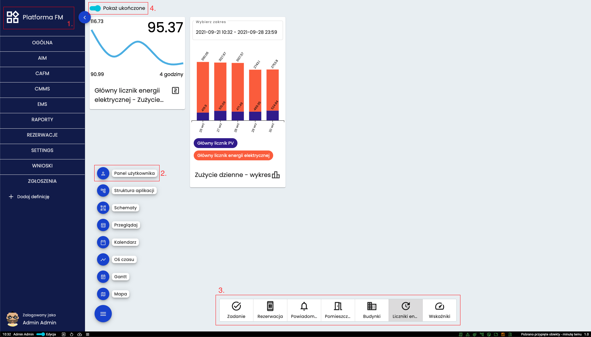

# Panel użytkownika
Panel użytkownika to zbiór kart przypisanych do każdego użytkownika. Służy do szybkiego i łatwego podglądu najważniejszych informacji. 

## Przejście do i sposób wyświetlania danych
Można do niego przejść poprzez kliknięcie na tytuł strony (1.) lub poprzez wybranie z rozwijanego menu (2.). Wybór definicji z której mają być widoczne karty następuje na dole strony (3.). Jeśli dana karta może mieć status zakończonej to u góry (4.) można wybrać czy karty z takim statusem mają być widoczne.

## Dodanie karty do panelu
Karta może zostać dodana manualnie poprzez kliknięcie ikony pinezki przy dowolnym obiekcie w systemie. Dodawanie następuje również automatycznie kiedy dany użytkownik jest w relacji do obiektu z definicją typu *TASK* i obiekt jest zamknięty. 

[Powrót do menu](README.md)