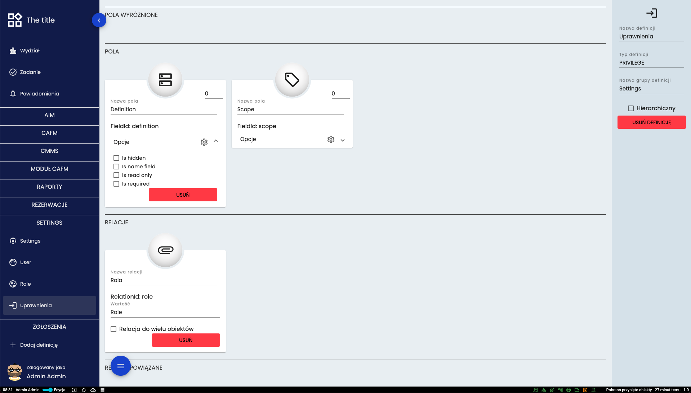

# Definicja
## Typy definicji i automatycznie tworzone pola
* *PLAIN* - pusta definicja
* *TASKS* - pola Name, Start, End i Done
* *RECURRENT_TASKS* - pola Name, Start, Repeat i Duration
* *NOTIFICATION* - pola Title, Date, Level, Description i Hidden
* *TREE* - 
* *USER* - pola First name, Last name, Active Directory, External ID, Email, Password
* *LOCATION* - pole Location
* *CANVAS* - 
* *IFC* - pole IFC
* *ROLE* - pole Name
* *PRIVILEGE* - pola Definition i Scope
* *RESERVATIONS* - pola Name, Start i End

Dodatkowo definicja może być hierarchiczna co oznacza, że do obiektu można stworzyć jego "podobiekt".  

## Panel definicji

* (1.) Miejsce wyboru ikony definicji
* (2.) Miejsce wprowadzenia nazwy definicji
* (3.) Miejsce wyboru typu definicji
* (4.) Miejsce wprowadzenia nazwy grupy definicji
* (5.) Miejsce włączenia typu hierarchicznego
* (6.) Przycisk usuwający definicję
* (7.) Miejsce wyboru dodatkowych pól definicji

## Pola

Ekran pól dzieli się na cztery części. Na samej górze są **POLA WYRÓŻNIONE**. Pola będące w tym miejscu będą widoczne w tabeli oraz na kartach danego obiektu. Poniżej jest miejsce na pozostałe pola widoczne po wejściu w szczegóły obiektu. Kolejna część odpowiada za relacje. Definicja wybrana na tej karcie pojawi się przy tworzeniu/edycji obiektu jako pole. Na samym dole pokazane są relację powiązane, czyli takie gdzie dana definicja jest polem w innej definicji. 

### Kolejność pól
Pola wyświetlane są w kolejności od lewej do prawej, z góry do dołu. Kolejność można zmienić kllikając i przeciągając kartę z danym polem w inne miejsce lub poprzez wpisanie liczby w prawym górym rogu karty. Karty z wartością ujemną będą wyróżnione. Im większa wartość ujemna ty wyżej pole będzie na karcie. Im wyższa wartość dodatnia tym niżej pole będzie usytuowane w danym obiekcie. 

### Opcje pól
*Is hidden* - czy pole ma być ukrytę. Po wybraniu tej opcji zobaczyć je będzie mógł tylko użytkownik posiadający uprawnienie do podglądu ukrytych pól.
*Is name field* - czy pole ma być nazwą obiektu. Jeśli ta opcja zostanie wybrana dla tylko jednego pola to nie będzie ono widoczne w tabeli/na karcie, ponieważ pojawi się jako nazwa całego obiektu.
*Is read only* - czy pole ma być w trybie tylko do odczytu. 
*Is required* - czy pole ma być obowiązkowe. Po wybraniu tej opcji nie będzie można zapisać obiektu jeśli to pole pozostanie nieuzupełnione. 

[Powrót do menu](README.md)