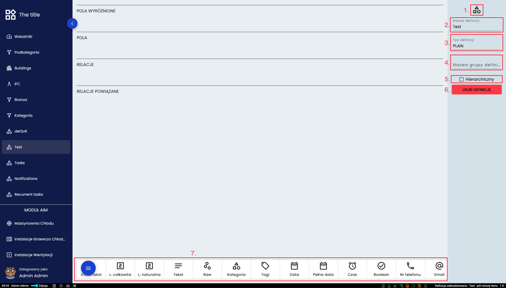

# Definicja
## Typy definicji i automatycznie tworzone pola
* *PLAIN* - pusta definicja
* *TASKS* - pola Name, Start, End i Done
* *RECURRENT_TASKS* - pola Name, Start, Repeat i Duration
* *NOTIFICATION* - pola Title, Date, Level, Description i Hidden
* *TREE* - 
* *USER* - pola First name, Last name, Active Directory, External ID, Email, Password
* *LOCATION* - pole Location
* *CANVAS* - 
* *IFC* - pole IFC
* *ROLE* - pole Name
* *PRIVILEGE* - pola Definition i Scope

Dodatkowo definicja może być hierarchiczna co oznacza, że do obiektu można stworzyć jego "podobiekt".  

## Panel definicji

* (1.) Miejsce wyboru ikony definicji
* (2.) Miejsce wprowadzenia nazwy definicji
* (3.) Miejsce wyboru typu definicji
* (4.) Miejsce wprowadzenia nazwy grupy definicji
* (5.) Miejsce włączenia typu hierarchicznego
* (6.) Przycisk usuwający definicję
* (7.) Miejsce wyboru dodatkowych pól definicji

Pola podpięte do **PÓŁ WYRÓŻNIONYCH** będą widoczne w tabeli oraz na kartach obiektu. 

[Powrót do menu](README.md)