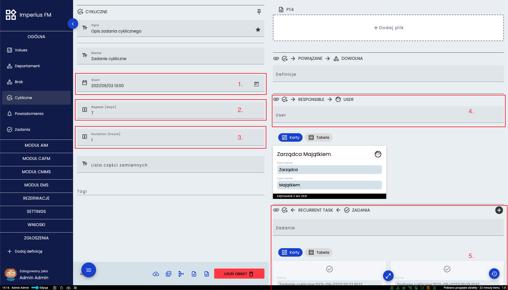

# Zadania cykliczne
## Umiejscowienie
Zadania cykliczne znajdują się w grupie **MODUŁ CMMS** a pojedyncze zadania w grupie **OGÓLNA**

## Działanie zadań cyklicznych
Zadanie cykliczne w sposób ciągły i w określonym interwale czasowym automatycznie tworzy pojedyncze zadania przypisane do konkretych użytkowników. Po zatwierdzeniu zakończenia obecnego zadania tworzone jest kolejne z domyślnymi ustawieniami. Na panelu głównym każdego użytkownika wyświetlane są zadanie w których jest osobą odpowiedzialną. 

## Karta zadania cyklicznego

(1.) Wybór daty początkowej
(2.) Co ile dni nowe zadanie ma zostać utworzone
(3.) Czas trwania pojedynczego zadania
(4.) Wybór odpowiedzialnego użytkownika
(5.) Miejsce wyświetlania utworzonych zadań (wyszarzone są już wykonane)