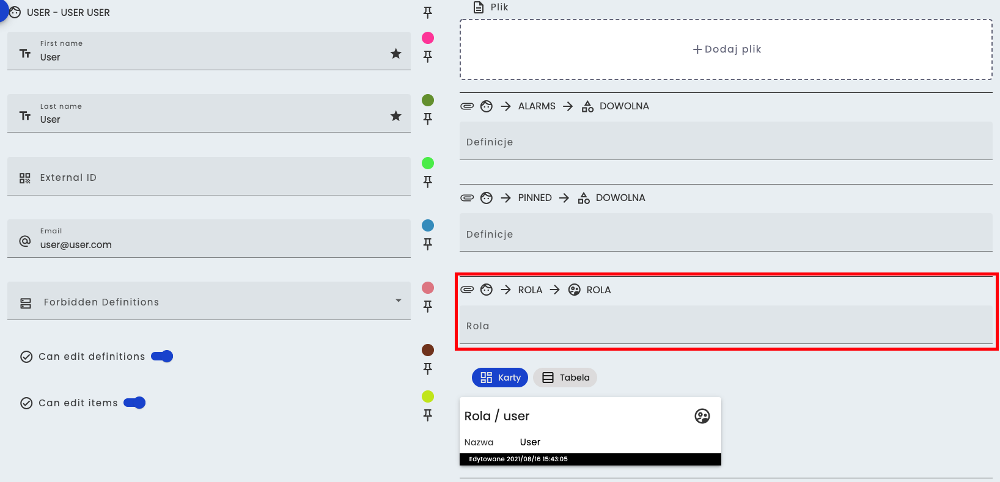
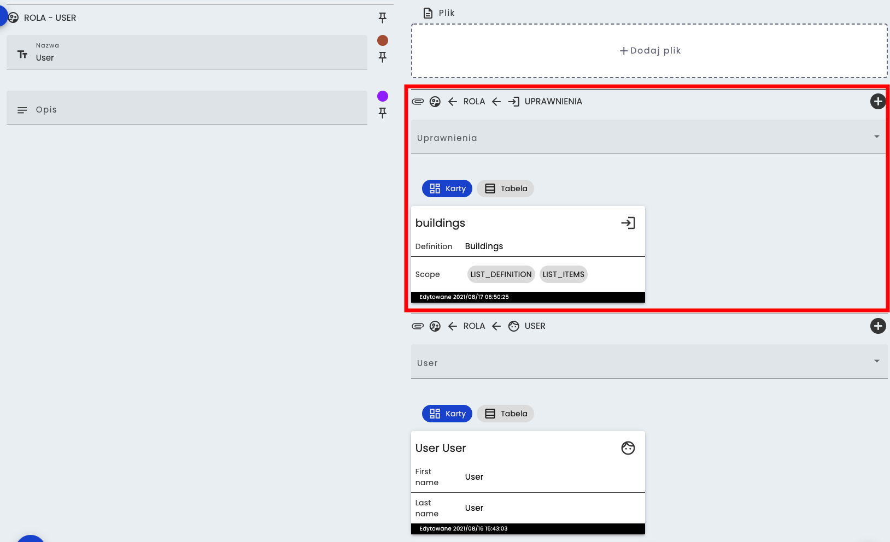
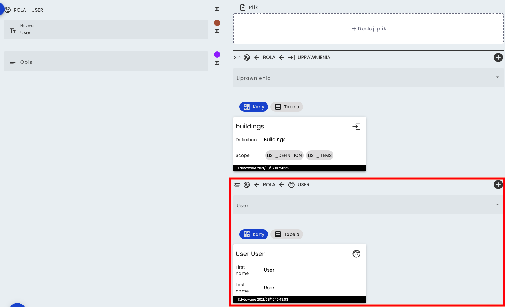
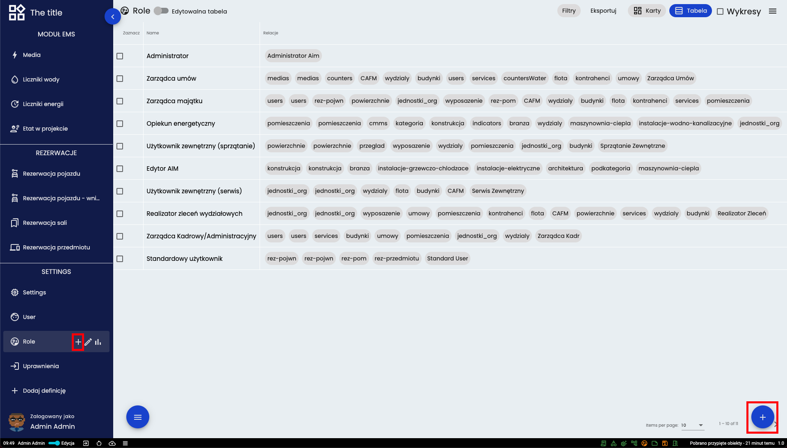
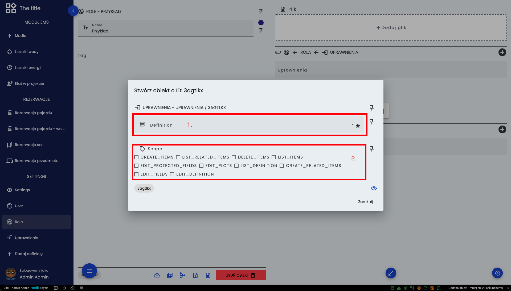
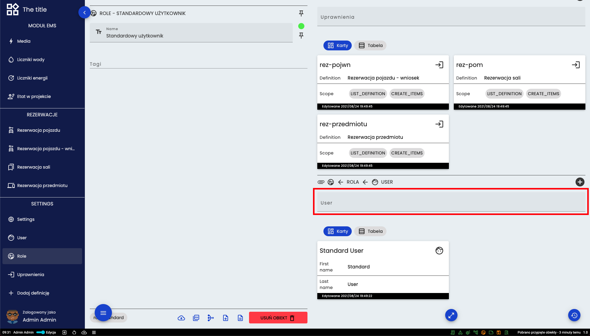

# Role
Rolą nazywamy zbiór uprawnień. Może być ona przypisana do jednego lub wielu użytkowników. Jeśli do użytkownika przypisanych będzie kilka ról gdzie jedna rola nie będzie miała uprawnień do jakiegoś działania a druga będzie posiadała takie uprawnienia to finalnie użytkownik będzie posiadał te uprawnienia. 

Na powyższym obrazku zaznaczone jest miejsce w którym wybrać można rolę dla danego użytkownika. 

Na powyższym obrazku zaznaczone zostało miejsce wyboru i pojawiania się przypisanych uprawnień do roli.

Na powyższym obrazku zaznaczone zostało miejsce wyboru i pojawiania się przypisanych użytkowników do roli.

## Tworzenie nowej roli i nadawanie uprawnień 

Utworzyć nową rolę można poprzeć przycisk plusa znajdujący się w dwóch powyżej zaznaczonych miejscach. Po kliknięciu ukaże się okno gdzie trzeba wpisać nazwę nowej roli po czym otwiera się jej karta.

1. W tym miejscu można wybrać i dodać już istniejące uprawnienie
2. Tutaj można utworzyć nowe uprawnienie

1. Wybór jakiej definicji ma dotyczyć uprawnienie
2. Prawa jakie dane uprawnienie będzie posiadać

## Przypisanie użytkownika do roli
