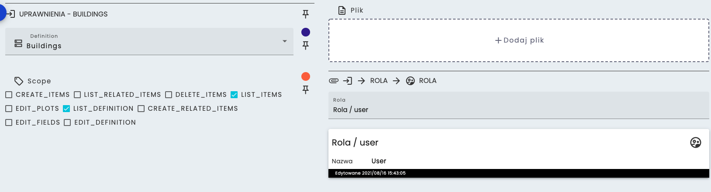
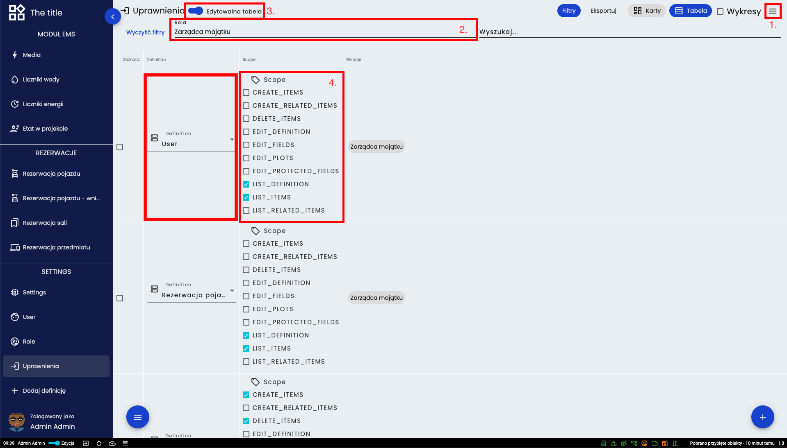

# Uprawnienia
Uprawnienia pozwalają na nadanie wybranych praw danej roli dla dowolnej definicji. Każde uprawnienie dotyczy tylko jednej wybranej definicji.

## Lista dostępnych uprawnień:
* **LIST_DEFINITION** - pozwala wyświetlić definicję na liście
* **EDIT_DEFINITION** - pozwala na edycję definicji
* **EDIT_PLOTS** - pozwala na edycję wykresów
* **CREATE_ITEMS** - pozwala na tworzenie obiektów
* **LIST_ITEMS** - pozwala na podgląd obiektów
* **LIST_RELATED_ITEMS** - pozwala na podgląd obiektów w relacji
* **CREATE_RELATED_ITEMS** - pozwala na tworzenie obiektów w relacji
* **VIEW_HIDDEN_FIELD** - pozwala na podgląd pól ukrytych
* **EDIT_HIDDEN_FIELDS** - pozwala na edycję pól ukrytych
* **EDIT_FIELDS** - pozwala na edycję pól
* **DELETE_ITEMS** - pozwala na usuwanie obiektu

Aby utworzyć nowy obiekt trzeba posiadać uprawnienia na tworzenie obiektu jak i na edycję pól, ponieważ w innym wypadku będzie można tylko utworzyć pusty obiekt.

Na powyższym obrazku widać przykładową kartę uprawnień. Wybrano definicję *Buildings*, przypisano do roli *user* z prawami **LIST_ITEMS** i **LIST_DEFINITION**.

## Zmiana zakresu uprawnień 

Zmiana uprawnień dla konkretnej roli może być wykonana w następujący sposób:
1. Otwarcie menu filtrów
2. Wybór odpowiedniej roli
3. Włączenie trybu edycji tabeli
4. Zmiana zakresu uprawnień przy odpowiedniej definicji

## Widoczność definicji w relacji
Aby widzieć obiekty, które są w relacji do danej definicji, potrzebne jest uprawnienie *LIST_RELATED_ITEMS* w podpiętej definicji. Przykład:
Do definicji A podpięta jest definicja B. Użytkownik wchodząc w obiekt z definicji A zobaczy obiekty z definicji B jeśli będzie miał uprawnienie *LIST_RELATED_ITEMS* do definicji B. 

[Powrót do menu](README.md)