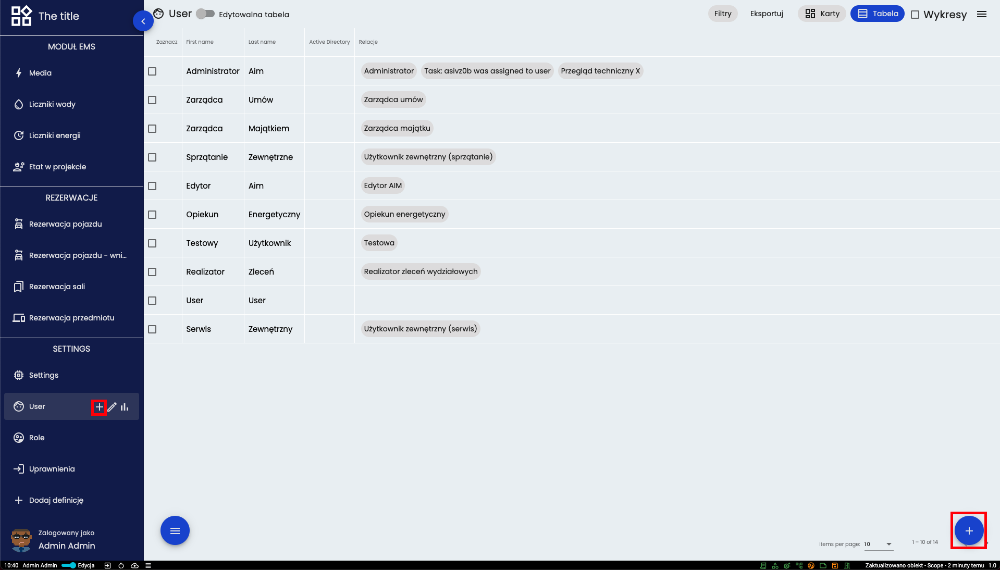
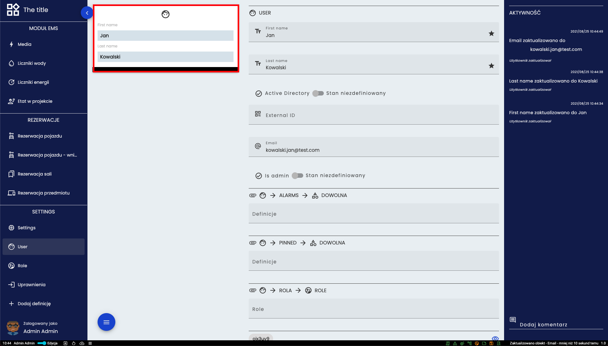
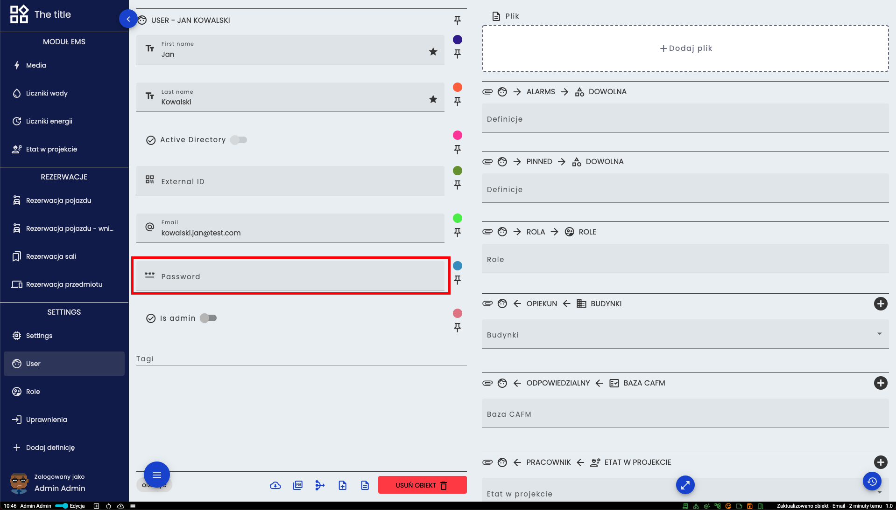
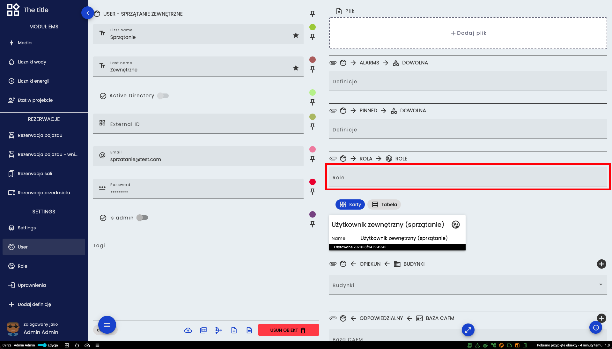
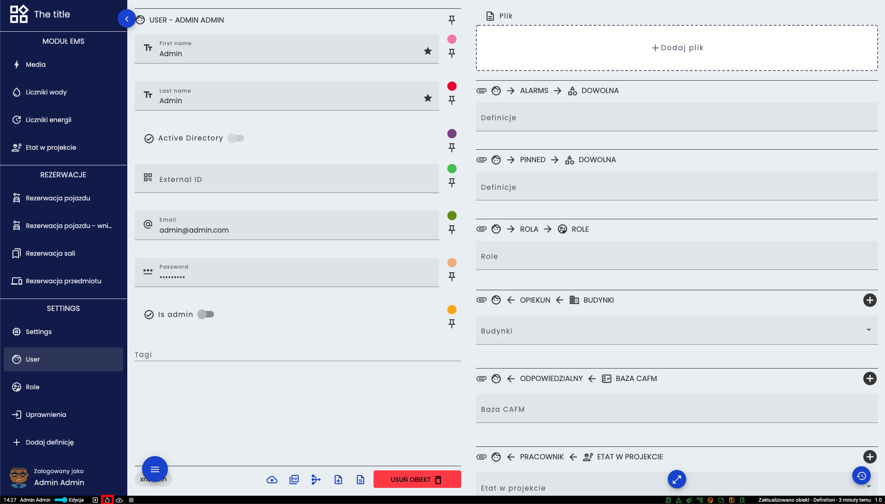
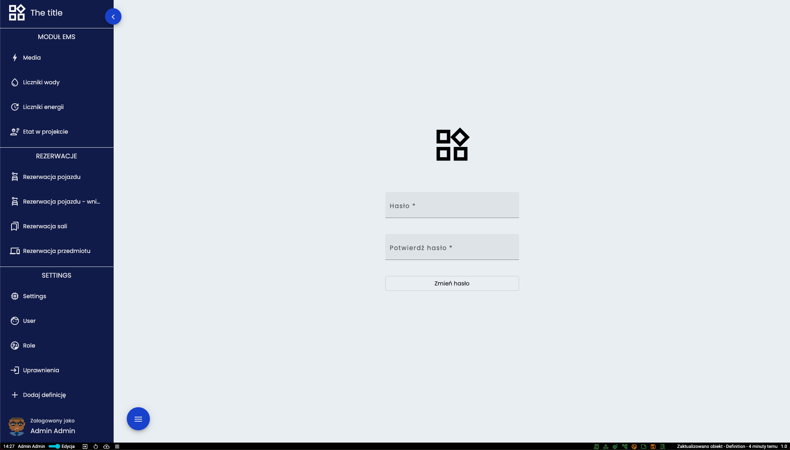

# Użytkownik
## Dodawanie nowego użytkownika

Dodawanie nowego użytkownika następuje poprzez jeden z przycisków plusa zaznaczonych powyżej. 

Po podaniu podstawowych danych trzeba kliknąć w wyżej zaznaczoną kartę.

Tutaj można nadać hasło danemu użytkownikowi. 

## Przypisanie roli do użytkownika

## Zmiana hasła na koncie

Przycisk zmiany hasła zaznaczony jest na powyższym obrazku.

Na tym ekranie trzeba dwukrotnie wprowadzić nowe hasło i wcisnąć przycisk.

[Powrót do menu](README.md)