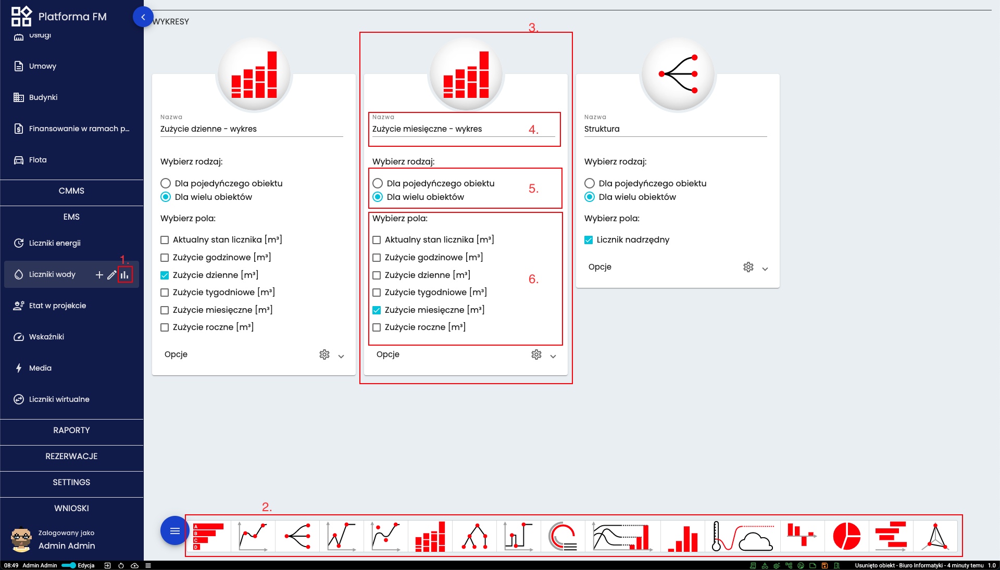

# Wykresy
Wykresy pozwalają na zwizualizowanie dostępnych danych. Dodanie wykresów dostępne jest dla każdej definicji. 

## Dodawanie wykresu

Aby dodać nowy wykres należy najechać kursorem na nazwę definicji a następnie kliknąć ikonę wykresu (1.) Na dole strony (2.) pokazane są wszystkie rodzaje dostępnych wykresów. Po kliknięciu w któryś rodzaj wyskoczy karta (3.). Należy w niej wprowadzić nazwę wykresu (4.), wybrać czy wykres ma dotyczyć jednego czy wielu obiektów (5.) jak i wybrać z jakiego pola (6.) wartości mają się pojawiać na wykresie. 

## Rodzaje wykresów

W systemie dostępnych jest wiele rodzajów wykresów. Począwszy od standardowych jak liniowe, słupkowe czy kołowe. Jest też również wykres wyświetlający prognozowaną temperaturę zewnętrzną czy też klasę energetyczną. 

[Powrót do menu](README.md)